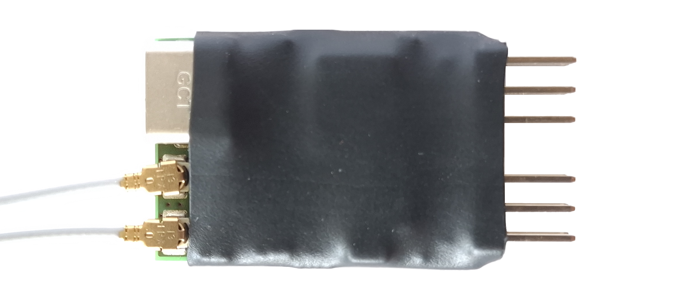

# rfl
4ch RC receiver/transmitter with switched diversity antennas to retrofit 35Mhz remotes.

## Parts
- SX1281 2.4GHz Transceiver IC
- SE2431L LNA/PA with up to +24 dBm
- STM32G0B1KET6N MCU
- TPS7A19 with up to 40V Vin

## Prototype

## Fimware
First prototype implementation with fixed frequency hopping table.