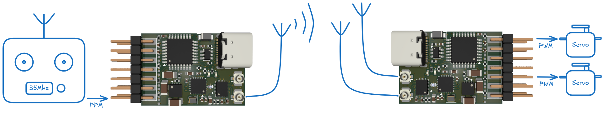

# rfl
4ch RC receiver/transmitter with switched diversity antennas to retrofit 35MHz remotes.

- PPM input on CH3 to connect to old 35MHz internal PPM signal
- Dual U.fl connectors for antennas (single transmit, dual receive)
- 4 PWM outputs (3.3V)
- USB-C for programming 

## Parts
- SX1281 2.4GHz Transceiver IC
- SE2431L LNA/PA with up to +24 dBm
- STM32G0B1KET6N MCU
- TPS7A19 with up to 40V Vin

## Assembly
QFN parts need a reflow oven/hot air station, the rest is 0402 or larger.

## Fimware
First prototype implementation with fixed frequency hopping table, very simple Rx-antenna diversity is "useable". The firmware currently checks for a valid PPM input if thats not found switches to receiver mode.